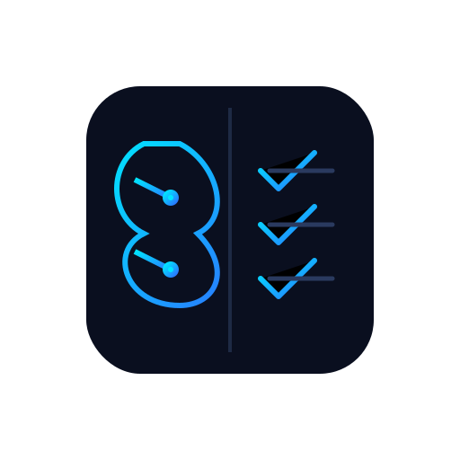

# TaskMind — Task Manager



A full-stack task management application with JWT-based authentication and real-time updates via Socket.IO, built with a React frontend and an Express + MongoDB backend.

---

## Overview

TaskMind lets users sign up, log in, and manage a personal list of tasks. Each task has a title, description, due date, priority level, and a status that can be toggled between active and completed. All task data is scoped to the authenticated user and persisted in MongoDB. Any mutation (create, update, delete, toggle) is instantly pushed to the client over a private Socket.IO room — no polling required.

---

## Tech Stack

| Layer | Technologies |
|-------|-------------|
| **Frontend** | React 19, React Router 7, Axios, Socket.IO Client, Lucide React, Vite, TypeScript |
| **Backend** | Node.js, Express 4, Socket.IO, TypeScript, ts-node-dev |
| **Database** | MongoDB, Mongoose |
| **Auth** | JWT stored in an `httpOnly` cookie |
| **Real-time** | Socket.IO — per-user private rooms, JWT-authenticated via cookie |
| **Validation** | Zod (backend schemas) |
| **Security** | Helmet, CORS, express-rate-limit, express-mongo-sanitize, bcryptjs |

---

## Project Structure

```
Task-Manager/
├── backend/                  # Express REST API + Socket.IO server
│   ├── src/
│   │   ├── app.ts            # Express app setup (middleware, routes, error handler)
│   │   ├── server.ts         # Entry point — connects DB, starts server, initialises Socket.IO
│   │   ├── socket.ts         # Socket.IO init, JWT middleware, per-user rooms
│   │   ├── config/db.ts      # Mongoose connection
│   │   ├── controllers/      # auth.controller.ts, task.controller.ts
│   │   ├── middleware/       # auth, validation, error, rate-limit
│   │   ├── models/           # User.model.ts, Task.model.ts
│   │   ├── routes/           # auth.routes.ts, task.routes.ts, index.ts
│   │   ├── schemas/          # Zod schemas for auth and task inputs
│   │   └── utils/            # jwt.ts, AppError.ts, apiResponse.ts
│   ├── .env.example
│   └── tsconfig.json
│
└── frontend/                 # React SPA (Vite)
    ├── src/
    │   ├── App.tsx            # Router setup and route protection
    │   ├── pages/             # LoginPage, SignupPage, DashboardPage
    │   ├── components/        # Navbar, AuthLayout, TaskCard, TaskFormModal
    │   ├── contexts/          # AuthContext, TaskContext
    │   ├── utils/
    │   │   ├── api.ts         # Axios instance with 401 handling
    │   │   └── socket.ts      # Socket.IO client (autoConnect: false, withCredentials)
    │   └── types/index.ts     # Shared TypeScript types
    ├── .env
    └── vite.config.ts
```

---

## Features

- **Authentication** — Signup and login set a signed `httpOnly` JWT cookie. Session is validated on load via `GET /api/auth/me` and cached in `localStorage`.
- **Task CRUD** — Create, read, update, and delete tasks. All operations are scoped to the logged-in user.
- **Real-time sync** — Every task mutation emits a Socket.IO event to the user's private room; the frontend updates its local state instantly without a refetch.
- **Toggle status** — Flip a task between `active` and `completed` in one click.
- **Filtering & sorting** — Filter by status and priority, full-text search, and server-side sorting including priority order.
- **Route protection** — The `/dashboard` route is behind a `PrivateRoute`; unauthenticated users are redirected to `/login`.
- **Hardened API** — Rate limiting on auth endpoints, Helmet security headers, Mongo sanitization, and Zod validation on all mutating requests.

---

## Real-time Architecture

Socket.IO is initialised on the same HTTP server as Express. Every connection is authenticated before it is accepted.

**Server (`backend/src/socket.ts`)**

1. On each new connection the Socket.IO middleware reads the `taskmind_token` value from the `Cookie` header and verifies it with the same JWT utility used by the REST API.
2. Authenticated sockets are placed in a private room keyed by `userId`.
3. After any task mutation in `task.controller.ts`, the relevant event is emitted directly to that user's room.

| Event | Emitted when |
|-------|-------------|
| `task:created` | A new task is created (`POST /api/tasks`) |
| `task:updated` | A task is updated or toggled (`PUT /api/tasks/:id`, `PATCH /api/tasks/:id/toggle`) |
| `task:deleted` | A task is deleted (`DELETE /api/tasks/:id`) |

**Client (`frontend/src/utils/socket.ts` + `TaskContext`)**

- The socket is created with `autoConnect: false` and `withCredentials: true` so the auth cookie is forwarded automatically.
- `TaskContext` calls `socket.connect()` when a user is logged in and `socket.disconnect()` on logout.
- The three events above are handled in `TaskContext` to patch local state in real time.

---

## API Endpoints

All task routes require a valid auth cookie.

| Method | Path | Description |
|--------|------|-------------|
| `GET` | `/health` | Liveness check |
| `POST` | `/api/auth/signup` | Register a new user |
| `POST` | `/api/auth/login` | Login and receive auth cookie |
| `POST` | `/api/auth/logout` | Clear auth cookie |
| `GET` | `/api/auth/me` | Get the current user |
| `GET` | `/api/tasks` | List tasks (supports `status`, `priority`, `search`, `sort`, `order` query params) |
| `GET` | `/api/tasks/:id` | Get a single task |
| `POST` | `/api/tasks` | Create a task |
| `PUT` | `/api/tasks/:id` | Update a task |
| `PATCH` | `/api/tasks/:id/toggle` | Toggle task status |
| `DELETE` | `/api/tasks/:id` | Delete a task |

---

## Data Models

**User** — `name`, `email` (unique), `password` (bcrypt hashed, never returned), timestamps.

**Task** — `userId` (ref User), `title`, `description`, `dueDate`, `priority` (`low` | `medium` | `high`), `status` (`active` | `completed`), timestamps.

---

## Getting Started

### Prerequisites

- Node.js 18+
- Docker (used to run MongoDB)

### Start MongoDB

```bash
docker run -d \
  --name mongodb \
  -p 27017:27017 \
  mongo:latest
```

This maps MongoDB to `localhost:27017`, which matches the default `MONGODB_URI` in `.env.example`.

### Backend

```bash
cd backend
cp .env.example .env       
npm install
npm run dev                 # starts ts-node-dev on PORT (default 5000)
```

### Frontend

```bash
cd frontend
npm install
npm run dev                 # starts Vite dev server on http://localhost:5173
```

The frontend expects the backend to be available at `http://localhost:5000`. Update `VITE_API_URL` in `frontend/.env` if you run on a different port.

---

## Environment Variables

### Backend (`.env`)

| Variable | Description |
|----------|-------------|
| `PORT` | HTTP port (default `5000`) |
| `MONGODB_URI` | MongoDB connection string (default `mongodb://localhost:27017/task_manager` for Docker on host port 27017) |
| `JWT_SECRET` | Secret key for signing JWTs |
| `JWT_EXPIRES_IN` | Token expiry, e.g. `7d` |
| `NODE_ENV` | `development` or `production` |
| `CORS_ORIGIN` | Allowed frontend origin — also used as the Socket.IO CORS origin (default `http://localhost:5173`) |

### Frontend (`.env`)

| Variable | Description |
|----------|-------------|
| Backend base URL, e.g. `http://localhost:5000/api` — the `/api` suffix is stripped automatically for the Socket.IO connection |
